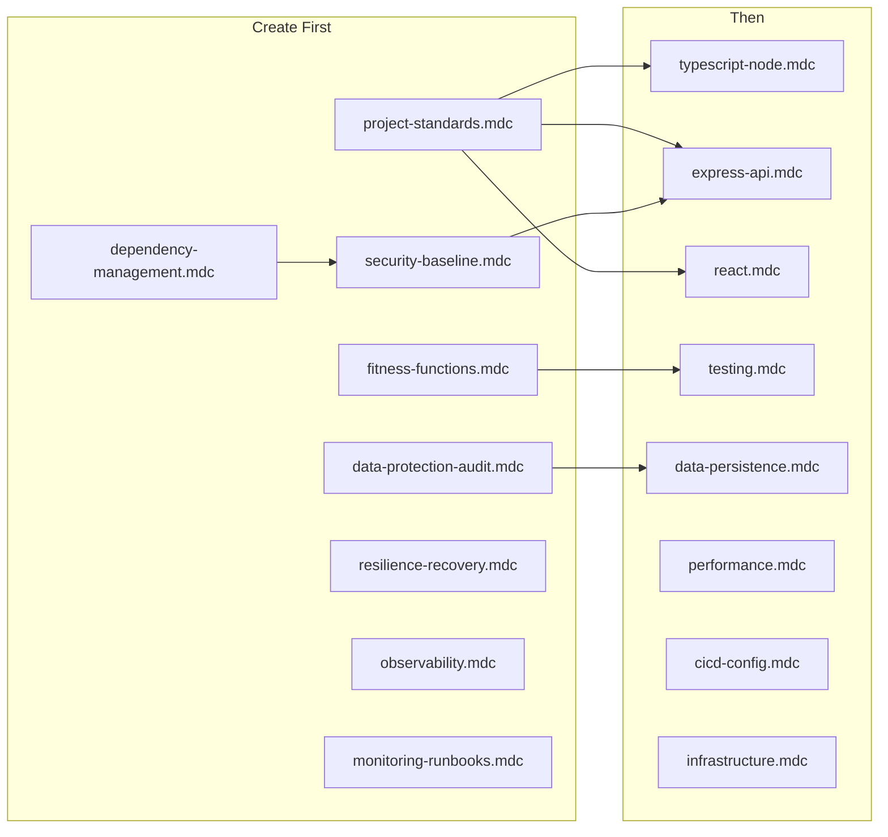

# Cursor Rules Implementation Plan

This plan specifies which rule files to create, their scope and purpose, content outlines, and dependencies. An implementing agent should create `.mdc` files in [.cursor/rules/](.cursor/rules/) with YAML frontmatter (`description`, `globs` or `alwaysApply`).

---

## Path coverage: happy, exception, and error paths

When implementing the rules, code and tests must explicitly address three paths:

- **Happy path:** Normal success flow; expected inputs and conditions; success responses.
- **Exception path:** Recoverable or expected deviations (e.g. validation failures, not found, conflict, rate limit). Handle explicitly; return clear status and payloads; log appropriately.
- **Error path:** Unexpected failures (e.g. unhandled exceptions, downstream outages, timeouts). Fail safely; no leaked internals; structured errors and logging; align with resilience and observability rules.

Rules that must reflect this: **project-standards**, **typescript-node**, **express-api**, **resilience-recovery**, **observability**, **testing**. Test coverage must include all three paths (see testing.mdc and unit coverage requirement below).

---

## 1. Rule files and scope

| Order | File                      | Scope                                                                                   | Purpose                                                                                          |
| ----- | ------------------------- | --------------------------------------------------------------------------------------- | ------------------------------------------------------------------------------------------------ |
| 1     | project-standards.mdc     | alwaysApply: true                                                                       | Cross-cutting ways of working, ACI, DDD, documentation, inclusive language                       |
| 2     | fitness-functions.mdc     | alwaysApply: true                                                                       | What fitness tests are, where they live, when to run, satisfy as checkpoint                      |
| 3     | security-baseline.mdc     | alwaysApply: true                                                                       | No secrets in code, env for config, OWASP alignment, injection/auth, dependency checks           |
| 4     | data-protection-audit.mdc | alwaysApply: true                                                                       | PII/sensitive data, retention, auditability, GDPR where applicable                               |
| 5     | dependency-management.mdc | alwaysApply: true                                                                       | Pinned versions, lockfiles, CVE handling and upgrade process                                     |
| 6     | resilience-recovery.mdc   | alwaysApply: true                                                                       | Fault tolerance, idempotency, circuit breakers, backup/restore, RTO/RPO                          |
| 7     | observability.mdc         | globs: **/*.ts                                                                          | Structured logging, correlation IDs, tracing, what not to log                                    |
| 8     | monitoring-runbooks.mdc   | alwaysApply: true                                                                       | Health checks, SLOs, alerting, runbooks/playbooks                                                |
| 9     | typescript-node.mdc       | globs: **/*.ts                                                                          | Code quality, SOLID, coupling, error handling (exclude .tsx in practice via separate React rule) |
| 10    | express-api.mdc           | globs: **/api/**/*.ts, **/routes/**/*.ts, **/server*.ts, **/app.ts                      | REST conventions, versioning, error response shape, no internal leakage in user-facing errors    |
| 11    | react.mdc                 | globs: **/*.tsx                                                                         | Components, hooks, accessibility (a11y)                                                          |
| 12    | testing.mdc               | globs: **/*.test.ts, **/*.spec.ts, **/*.test.tsx                                        | Unit/integration/e2e, test layout, reference to fitness functions                                |
| 13    | data-persistence.mdc      | globs: **/models/**/*.ts, **/repositories/**/*.ts, **/db/**/*.ts, **/migrations/**/*.ts | Schema, migrations, PII handling (align with data-protection-audit)                              |
| 14    | performance.mdc           | globs: **/api/**/*.ts, **/server/**/*.ts                                                | Performance budgets, scaling, caching and invalidation                                           |
| 15    | cicd-config.mdc           | alwaysApply: true                                                                       | Automated builds/deployments, env-specific config, no secrets in repo, feature flags             |
| 16    | infrastructure.mdc        | globs: **/*.tf, **/Dockerfile*, **/.github/**/*.yml, **/ci/**/*.yml                     | IaC: reproducible environments, change control where used                                        |

**Note:** For `typescript-node.mdc`, use globs that match backend/Node TS files (e.g. `server/**/*.ts`, `**/*.ts` with React rule taking precedence for `.tsx`) so React and Node rules do not overlap on the same file.

---

## 2. Content outline per rule

**project-standards.mdc**  
• Branch and commit message conventions • When to write ADRs and where to store them • DDD: bounded context names in folder/module structure • Availability, confidentiality, integrity as non-negotiable design constraints • **Design and implement all three paths: happy path, exception path, error path**—not only the happy path • Inclusive language in code and docs • Reference fitness-functions rule for "satisfy fitness tests" checkpoint

**fitness-functions.mdc**  
• Definition: tests that guard architecture/quality invariants • Where they live (e.g. `tests/fitness/` or documented path) • When to run (CI, pre-commit, or both) • All changes must satisfy fitness functions before merge

**security-baseline.mdc**  
• No secrets or credentials in code or repo; use env/config • Align with OWASP Top 10 where relevant • Input validation, parameterized queries, auth basics • Dependency checks (link to dependency-management for CVE process)

**data-protection-audit.mdc**  
• PII and sensitive data: minimise, encrypt at rest/transit where required • Retention and deletion expectations • Auditability: who did what when; immutable audit logs where needed • GDPR/compliance where applicable

**dependency-management.mdc**  
• Pinned versions and lockfiles (package-lock.json, yarn.lock, etc.) • CVE handling and upgrade process • No unvetted new dependencies without review

**resilience-recovery.mdc**  
• Fault tolerance and graceful degradation • Idempotency for APIs and background jobs • Circuit breakers or bulkheads for external calls where appropriate • **Explicit handling of error path**: unexpected failures, timeouts, downstream errors; fail safely and consistently • Backup/restore expectations; RTO/RPO where defined

**observability.mdc**  
• Structured logging; no secrets or PII in logs • Correlation/request IDs and tracing • Consistent log levels and fields • **Log and trace across happy, exception, and error paths**; ensure error path is observable for debugging and alerting

**monitoring-runbooks.mdc**  
• Health checks (liveness/readiness) • SLOs and alerting • Runbooks or playbooks for incidents and common operations

**typescript-node.mdc**  
• Strict TypeScript; avoid `any` • SOLID and low coupling • **Error handling: implement happy, exception, and error paths**; typed errors, no swallowed exceptions; explicit handling for exceptions and unexpected errors • Node/Express conventions (async error propagation)

**express-api.mdc**  
• REST conventions, versioning (e.g. /v1/), consistent error response shape • **Happy path: 2xx success responses; exception path: 4xx (validation, not found, conflict) with clear payloads; error path: 5xx with safe, non-internal messages** • User-facing errors: no leakage of internals (confidentiality) • Validation and status codes

**react.mdc**  
• Functional components and hooks • Accessibility (a11y): semantics, focus, contrast; WCAG where applicable

**testing.mdc**  
• **Unit test coverage: achieve 80–100% for production code**; enforce via CI (e.g. coverage threshold or gate) • **Test all three paths: happy path, exception path, error path**; unit tests for each, plus integration/e2e where appropriate • Unit, integration, e2e expectations and layout • Reference fitness functions; tests must pass and fitness tests must be satisfied

**data-persistence.mdc**  
• Schema changes and migrations • PII handling in persistence (see data-protection-audit)

**performance.mdc**  
• Performance budgets (e.g. latency p95) where defined • Scaling and caching; cache invalidation consistent with data integrity

**cicd-config.mdc**  
• Automated builds and deployments • Env-specific config; no secrets in repo • Feature flags where useful

**infrastructure.mdc**  
• IaC for reproducible environments • Change control for infra changes

---

## 3. Dependencies

- **Create first (no dependency on other rule files):** project-standards, fitness-functions, security-baseline, data-protection-audit, dependency-management, resilience-recovery, observability, monitoring-runbooks.  
- **Then:** typescript-node, express-api, react, testing, data-persistence, performance, cicd-config, infrastructure.  
- **References:** project-standards references fitness-functions; testing references fitness-functions; security-baseline references dependency-management; data-persistence and express-api align with data-protection-audit and security-baseline.

---

## 4. Implementation order for agent

1. Create [.cursor/rules/](.cursor/rules/) if it does not exist.
2. Create rules in the order of the table (1–16).
3. For each file: add YAML frontmatter with `description` and either `alwaysApply: true` or `globs: <pattern>`, then add the bullet-point content as concise rule body (under ~50 lines per rule; split into multiple rules if a topic grows).
4. Do not write full prose; keep rule content actionable (do/don't, examples where helpful).
5. Ensure the rule bodies reflect happy/exception/error path guidance and 80–100% unit test coverage where specified in the outlines above.

---

## 5. Success criteria check

- Every topic in the prompt's Context/scope is covered by at least one rule.  
- Each rule has a unique scope (no overlapping globs for the same concern).  
- Dependencies are explicit; an agent can create files in order without guessing.  
- An agent can create the `.mdc` files from these outlines without further clarification.  
- Result supports production-ready products (ACI, security, resilience, observability, compliance, deployment).  
- **Path coverage:** Rules and resulting code address happy, exception, and error paths; testing rule requires tests for all three.  
- **Unit test coverage:** Testing rule enforces 80–100% unit test coverage for production code (enforced in CI).
