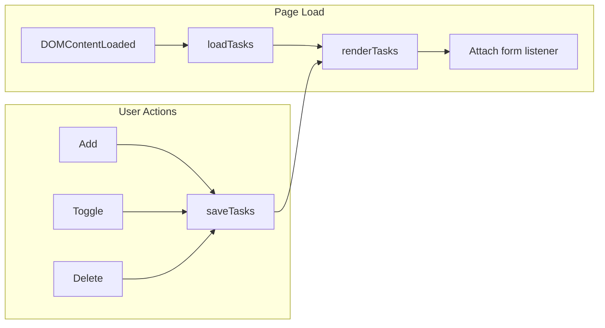

# Vanilla To-Do App (Minimal)

## Scope

- **Stack:** Vanilla HTML, CSS, JavaScript (no frameworks).
- **Features:** Add task, mark complete/uncomplete, delete task; list persists across reloads via `localStorage`.

## Structure

```
Experiment/
  index.html      # Single page: form + list container
  styles.css      # Layout and styling
  app.js          # Data + DOM logic and localStorage
  README.md       # Update with project description
```

## Data Model

- **Task:** `{ id: string, text: string, completed: boolean }`
- **Storage:** Array of tasks in `localStorage` under one key (e.g. `todos`). Load on init, save after every add/toggle/delete.

## Implementation

### 1. [index.html](index.html)

- Semantic layout: `<header>`, `<main>`, optional `<footer>`.
- **Input area:** `<form>` with text `<input>` and "Add" `<button>` (or submit).
- **List:** `<ul>` or `<ol>` with `id` so JS can target it. Each item will be a `<li>` containing:
  - Checkbox (completed state)
  - Task text (inline or in a span)
  - Delete button
- No inline scripts; load `styles.css` and `app.js`.

### 2. [styles.css](styles.css)

- Basic reset or normalize (optional).
- Layout: centered container, comfortable max-width.
- List styling: spacing, clear tap/click targets for checkbox and delete.
- Completed state: e.g. strikethrough + muted color for `text` when `completed === true`.
- Responsive: readable on small screens (stack or full-width controls).

### 3. [app.js](app.js)

- **State:** One array, e.g. `let tasks = []`.
- **Storage helpers:**
  - `loadTasks()`: `JSON.parse(localStorage.getItem('todos') ?? '[]')`, assign to `tasks`.
  - `saveTasks()`: `localStorage.setItem('todos', JSON.stringify(tasks))` after any change.
- **Render:** `renderTasks()` (or similar):
  - Clear list container.
  - For each task: create `<li>`, checkbox, text node, delete button; set checkbox checked from `task.completed`, attach listeners; append to list.
- **Event handlers:**
  - **Form submit:** prevent default, read input value, push `{ id: Date.now().toString(), text, completed: false }`, save, render, clear input.
  - **Checkbox change:** find task by `id`, toggle `completed`, save, render (or just update that item in the DOM).
  - **Delete click:** remove task from array by `id`, save, render.
- **Init:** On DOMContentLoaded, `loadTasks()`, then `renderTasks()`, then attach form submit listener.

### 4. [README.md](README.md)

- Short description: minimal to-do app, vanilla HTML/CSS/JS, localStorage.
- How to run: open `index.html` in a browser (or use a simple local server if you add one later).

## Flow



## Out of Scope (for this minimal version)

- No backend or database.
- No due dates, categories, or filters.
- No user accounts or multi-device sync.
